Docker version 24.0.2, build cb74dfc

Para verificar si el grupo docker ya existe en tu sistema, puedes usar el siguiente comando:
getent group docker

Crear el grupo docker (si aún no existe):
sudo groupadd docker

Agregar tu usuario al grupo docker:
sudo usermod -aG docker $USER

Para borrar todas las imágenes que aparecen con docker images, puedes usar el siguiente comando:
docker rmi $(docker images -q)
Explicación:
docker images -q obtiene solo los IDs de todas las imágenes.
docker rmi elimina esas imágenes.

Si algunas imágenes están en uso por contenedores, es posible que el comando falle. 
Para forzar la eliminación, puedes hacer lo siguiente:
Eliminar todos los contenedores primero (si hay contenedores creados o en ejecución):
- Command Substitution -
docker rm -f $(docker ps -aq)
Luego, eliminar todas las imágenes forzadamente:
docker rmi -f $(docker images -q)

eliminar solo las específicas con:
docker rmi <IMAGE_ID>

Si necesitas ver el ID completo del contenedor, usa:
docker inspect --format="{{.Id}}" <NOMBRE_O_ID_DEL_CONTENEDOR>

También puedes listar todos los contenedores con su ID completo usando:
docker ps -a --no-trunc
Este comando mostrará los contenedores sin truncar los IDs.

Cuando borras la imagen con docker image rm ubuntu, la salida muestra tres tipos de información clave:

"Untagged: ubuntu:latest"

Se elimina la referencia ubuntu:latest de la imagen en tu sistema.
Esto significa que ya no puedes usar ubuntu como nombre de imagen, pero la imagen en sí todavía podría existir si tiene otros tags.
"Untagged: ubuntu@sha256:..."

También se elimina la referencia basada en el digest SHA256, que es una firma única de la imagen.
Docker usa estos valores para identificar imágenes específicas más allá de sus nombres.
"Deleted: sha256:..."

Finalmente, se eliminan las capas de la imagen del sistema.
Docker almacena las imágenes en capas y solo las borra completamente si no están siendo usadas por otro contenedor o imagen.
En este caso, sha256:a04dc4851cbc... y sha256:4b7c01ed0534... son capas que formaban parte de la imagen y fueron eliminadas.
💡 ¿Qué significa esto?

Si la imagen solo tenía el tag ubuntu:latest, ahora está completamente eliminada.
Si había otros tags apuntando a la misma imagen, solo se habrían "desetiquetado" en lugar de eliminarse.
Si algún contenedor en ejecución o detenido dependiera de la imagen, Docker no la habría eliminado sin la opción -f (docker image rm -f ubuntu).

Kubernetes - servidor de desarrollo
https://minikube.sigs.k8s.io/docs/start

Para bajar el cliente:
https://kubernetes.io/docs/tasks/tools/install-kubectl-linux/

minikube delete
minikube version: v1.35.0

vanesa.manzanelli@infraPC-0484:~$ minikube start --driver=docker
😄  minikube v1.35.0 en Ubuntu 24.04
✨  Using the docker driver based on user configuration
📌  Using Docker driver with root privileges
👍  Starting "minikube" primary control-plane node in "minikube" cluster
🚜  Pulling base image v0.0.46 ...
💾  Descargando Kubernetes v1.32.0 ...
    > preloaded-images-k8s-v18-v1...:  333.57 MiB / 333.57 MiB  100.00% 1.67 Mi
    > gcr.io/k8s-minikube/kicbase...:  500.31 MiB / 500.31 MiB  100.00% 2.13 Mi
🔥  Creating docker container (CPUs=2, Memory=3900MB) ...

🧯  Docker is nearly out of disk space, which may cause deployments to fail! (96% of capacity). You can pass '--force' to skip this check.
💡  Suggestion: 

    Try one or more of the following to free up space on the device:
    
    1. Run "docker system prune" to remove unused Docker data (optionally with "-a")
    2. Increase the storage allocated to Docker for Desktop by clicking on:
    Docker icon > Preferences > Resources > Disk Image Size
    3. Run "minikube ssh -- docker system prune" if using the Docker container runtime
🍿  Related issue: https://github.com/kubernetes/minikube/issues/9024

🐳  Preparando Kubernetes v1.32.0 en Docker 27.4.1...
    ▪ Generando certificados y llaves
    ▪ Iniciando plano de control
    ▪ Configurando reglas RBAC...
🔗  Configurando CNI bridge CNI ...
🔎  Verifying Kubernetes components...
    ▪ Using image gcr.io/k8s-minikube/storage-provisioner:v5
🌟  Complementos habilitados: default-storageclass, storage-provisioner
🏄  Done! kubectl is now configured to use "minikube" cluster and "default" namespace by default

Verificar si el cluster esta corriendo :
vanesa.manzanelli@infraPC-0484:~$ kubectl get nodes
NAME       STATUS   ROLES           AGE   VERSION
minikube   Ready    control-plane   43s   v1.32.0

Clase 2:

¿Cómo limpiar los contenedores detenidos?
Si quieres eliminar todos los contenedores detenidos de una vez, puedes ejecutar:
docker container prune

Generar multiplataformas
docker buildx create --use
docker buildx build --platform linux/amd64,linux/arm64 -t diegochavezcarro/pythondocker:parte1 --push .

the 12 FActor App
https://12factor.net/disposability

Kubernetes:
https://github.com/diegochavezcarro/kube-labs/blob/main/instrucciones.txt

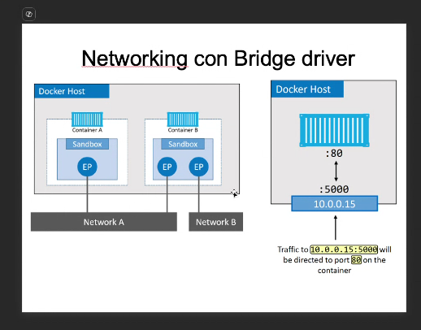

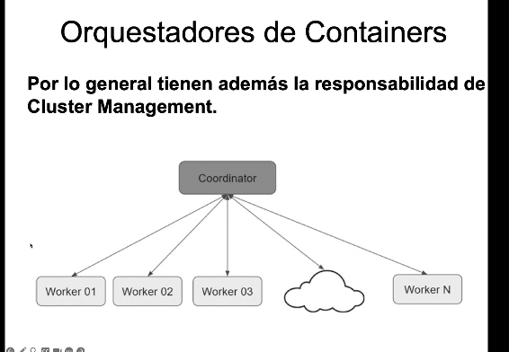

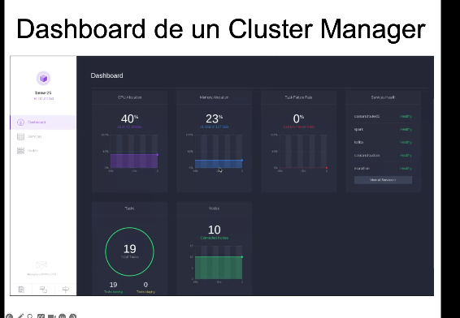

que es una db distribuida? en gral y en kubernetes?

scheduler: controla hacia donde van los contenedores

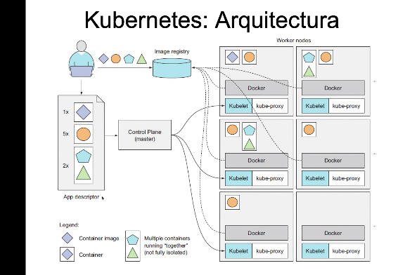

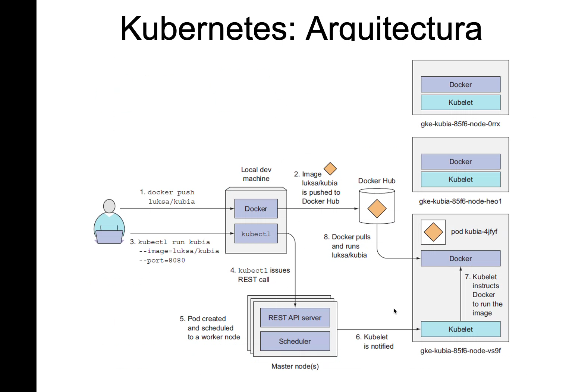

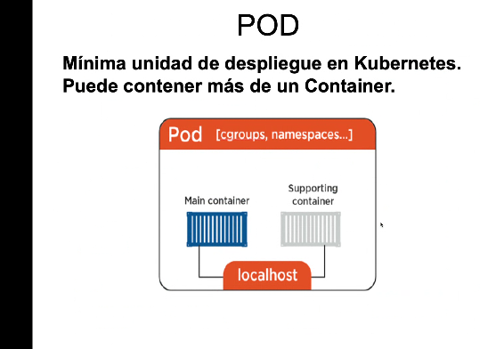

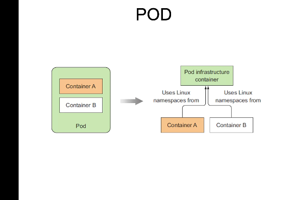

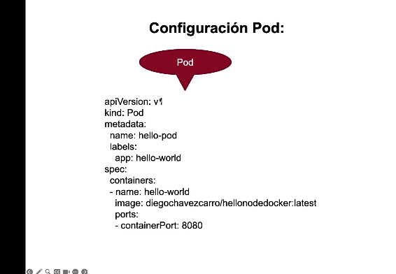

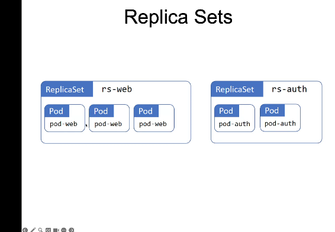

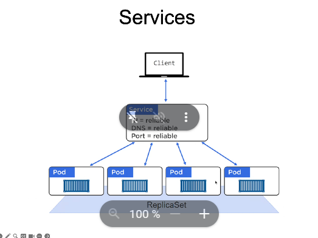

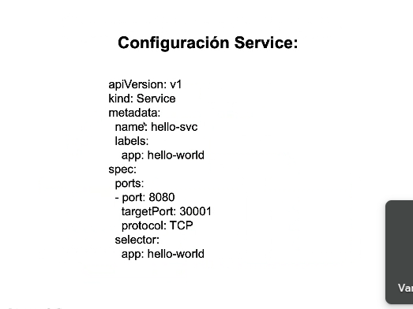

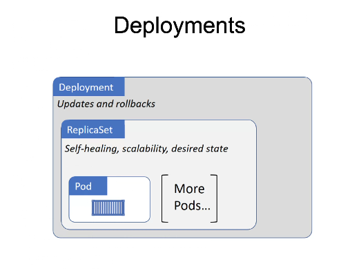

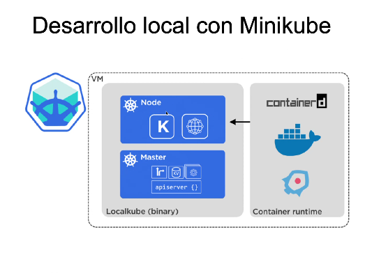

minikube profile list

minikune dashboard

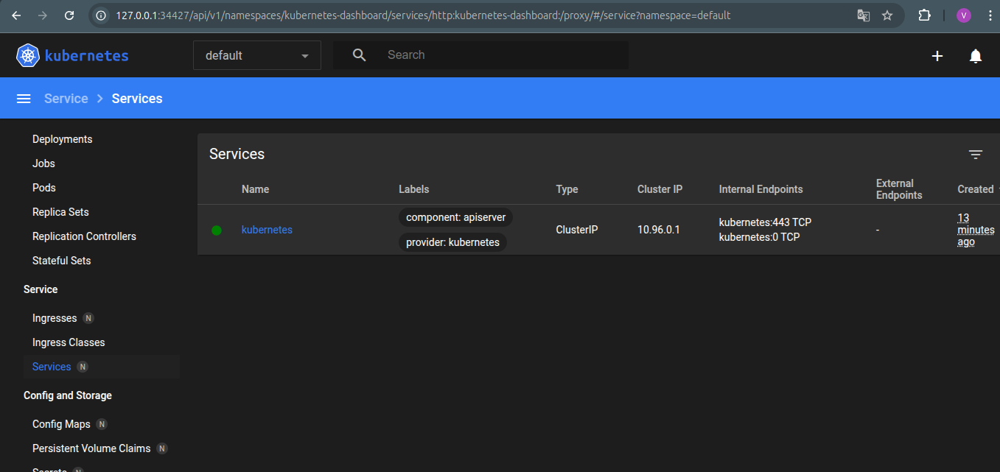

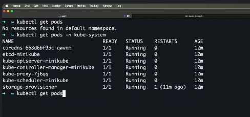